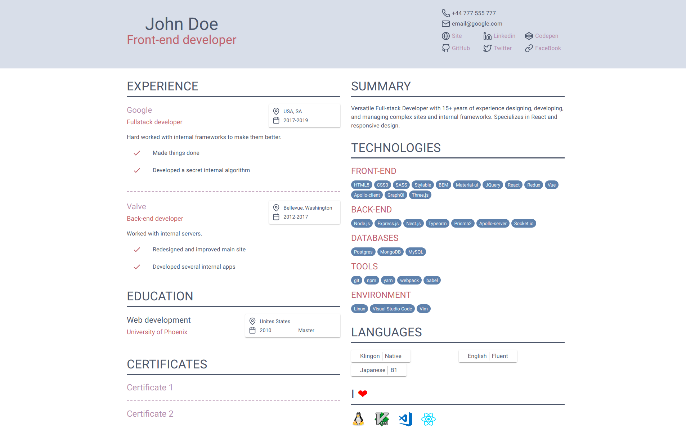

# Create React CV

A React CV template with a customizable color scheme and a layout.
Can generate `.pdf` file.

This project was bootstrapped with [Create React App](https://github.com/facebook/create-react-app) and [@stylable/react-scripts](https://github.com/wix/stylable/tree/master/packages/react-scripts).

## Quick Overview

```sh
npm install
npm start
npm run pdf
```

## Demo



## Making your own CV

1. Clone git repository: `git clone https://github.com/JustCaptcha/create-react-cv.git`
2. Install all dependencies: `npm intall`
3. Run the local development server: `npm start`
4. Input your own data in the `./src/person.tsx` file.
5. In a separate tab run command: `npm run pdf`
6. Grab your generated pdf file from folder `./pdf`

## Customization

### Changing color scheme

put your colors into css variables

`./src/project.st.css`

```css
:vars {
    color-primary: #5E81AC;
    color-secondary: #BF616A;
    color-text: #4C566A;
    color-link: #B48EAD;
}
```

`./src/app.tsx`

```tsx
const theme = createMuiTheme({
    typography: {
        htmlFontSize: 10,
    },
    palette: {
        primary: {
            main: '#5E81AC',
        },
        secondary: {
            main: '#BF616A',
        }
    }
})
```

### Changing layout

rearrange components or comment that doesn't need.

`.src/Pages/Main.tsx`
